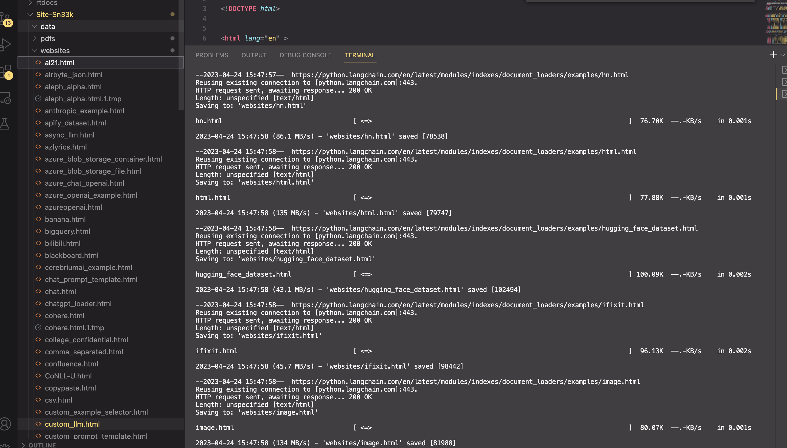
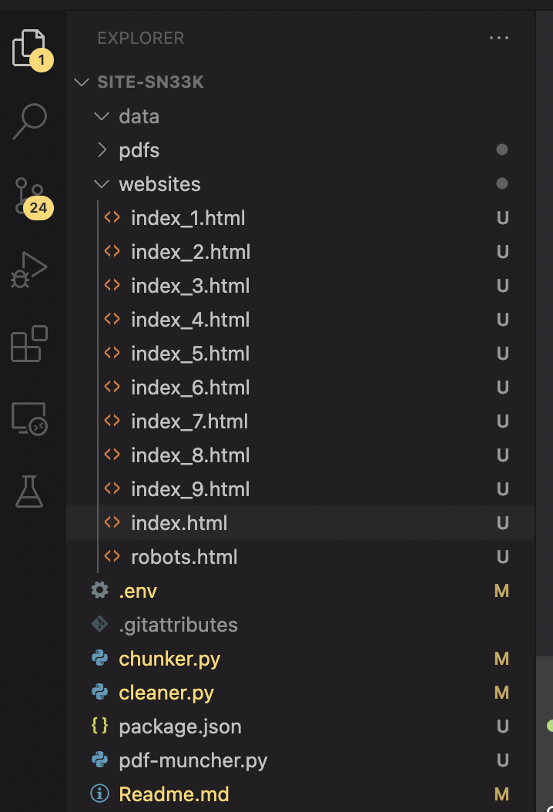
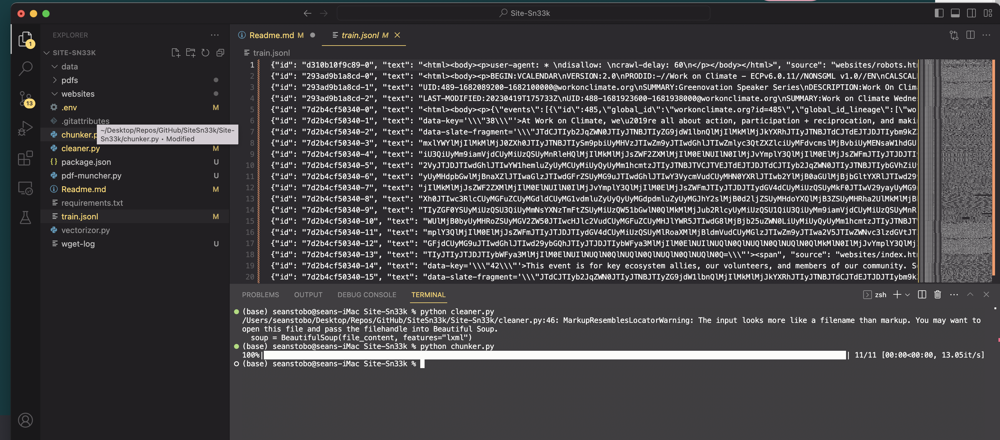
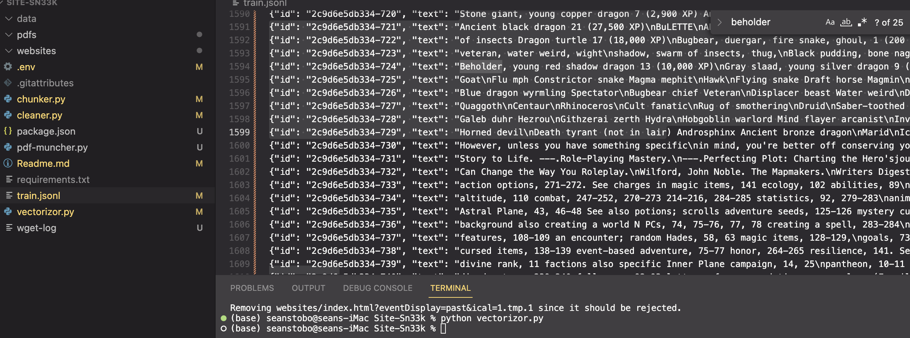

# Website Scraper, And PDF Chunker/Vectorizer for Pinecone DB

This Python repository contains a set of scripts that allow you to scrape a website, clean the data, organize it, chunk it, and then vectorize it. The resulting vectors can be used for a variety of machine learning tasks, such as similarity search or clustering.
Recently added a script to consume PDFs and add them to the training data as well.

## Files
THESE FUNCTIONS CONSUME THE FILES THEY PROCESS (only in the websites and pdfs directories)

- `cleaner.py`: This script downloads a website using wget, reads and cleans the HTML files using Beautiful Soup, and saves the resulting text files in a specified directory.
- `chunker.py`: This script splits the text files into smaller chunks, using a recursive character-based text splitter. The resulting chunks are saved in a JSONL file.
- `vectorizor.py`: This script loads the JSONL file, creates embeddings using OpenAI's text-embedding-ada-002 model, and indexes the embeddings using Pinecone. This is the one script you need api keys to run
- `pdf-muncher.py`: This will consume every PDF you put in the pdf-docs folder, and add it to the vectorized train.json

## Requirements

- Python 3.x
- OpenAI API key
- Pinecone API key
- `bs4` Python library
- `jsonlines` Python library
- `tqdm` Python library
- `tiktoken` Python library
- `pinecone-client` Python library

## Usage

1. Clone the repository and navigate to the project directory.
2. Install the required Python libraries using `pip install -r requirements.txt`.
3. Set up your OpenAI and Pinecone API keys.
4: Download the website - copy and run the wget command: 
  `wget -r -np -nd -A.html,.txt,.tmp -P websites https://your-website`
5. Run `python cleaner.py` to download and clean the website data. - This will break down the directory structure into on list of html docs.
6. Run `python chunker.py` to split the text files into smaller chunks. This outputs train.json in the root
7. Run `python vectorizor.py` to create embeddings and index them using Pinecone. This will vectorize train.json

Note: Before running `vectorizor.py`, make sure to set up a Pinecone database with 1536 dimensions.
